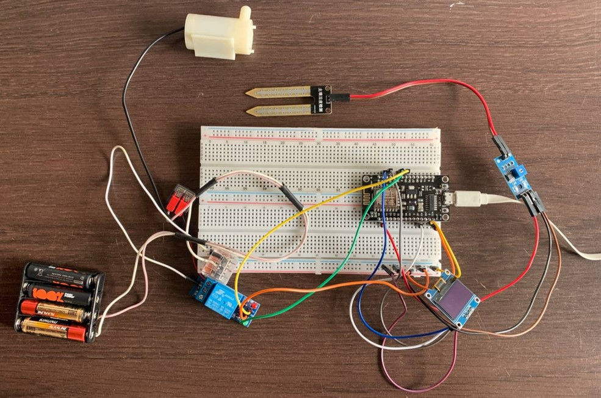
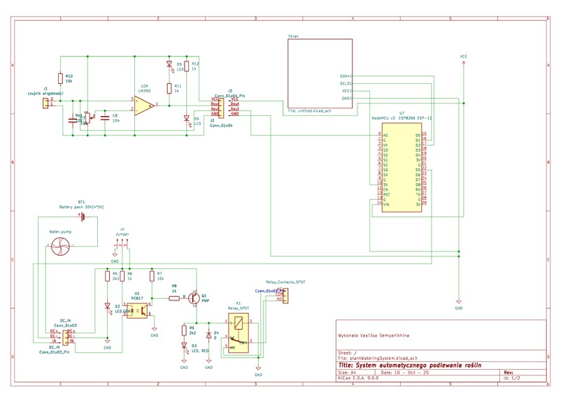
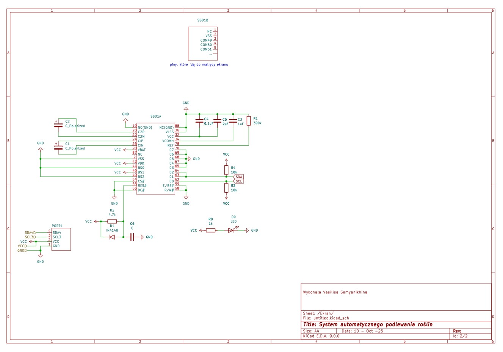
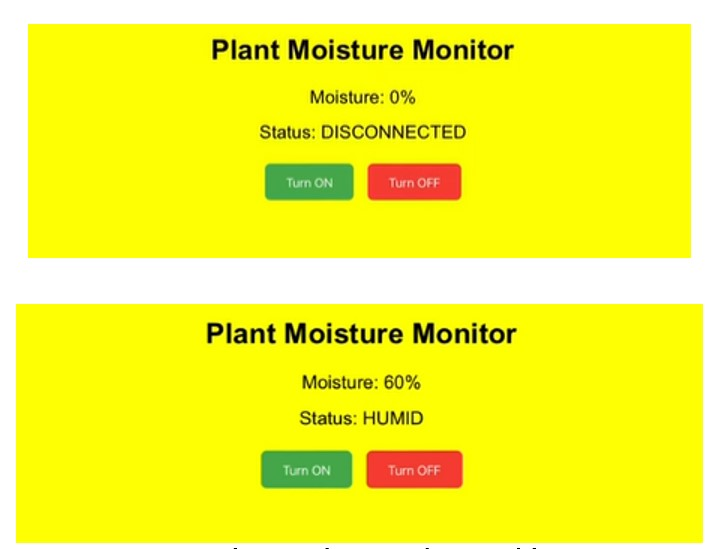
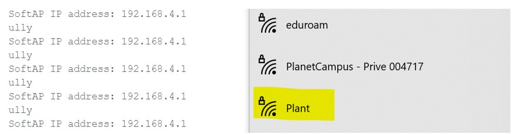
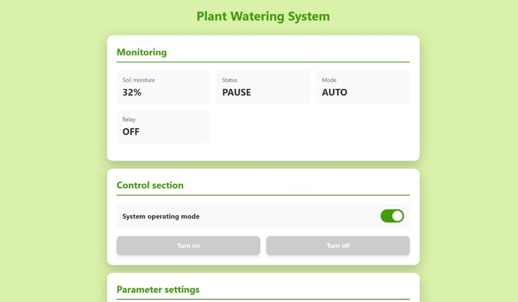
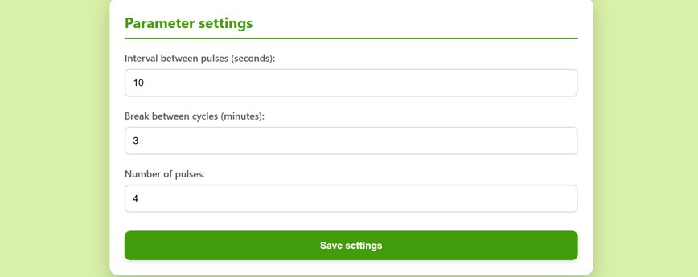

#  Plant Watering System with ESP8266

An automatic plant watering system built using the ESP8266 microcontroller. The project monitors soil moisture, automatically waters plants, and provides a wireless web interface for monitoring and manual control.

---

# Project Overview

This project started as a simple experiment with soil moisture sensors and gradually evolved into a complete smart irrigation platform with:

- Automatic watering
- Soil moisture monitoring
- OLED display visualization
- Relay-controlled water pump
- Manual and automatic modes
- Adjustable watering settings
- Web-based control panel
- Standalone Wi-Fi Access Point (SoftAP)

The system is designed to work independently without requiring an external router or internet connection.

---

# Project Evolution

## 1. Hardware Testing & Initial Prototype

The first stage focused on:
- Learning how each hardware component works
- Building the first electrical prototype
- Testing sensor readings
- Creating initial watering logic

### Main Components
- NodeMCU ESP8266
- Soil moisture sensor (LM393)
- Relay module
- OLED display
- Mini water pump
- Breadboard and jumper wires

### Initial Logic
The ESP8266:
1. Reads soil moisture values
2. Checks if the soil is dry
3. Turns on the water pump through the relay
4. Stops watering after a few seconds
5. Displays current status on the OLED display





---

## 2. Sensor Calibration & Moisture Processing

The soil moisture sensor returns analog values between `0 - 1024`.

Initial observations:
- `1024` → sensor disconnected
- High values → dry soil
- Low values → wet soil

To make readings more intuitive:
- Values were reversed using a custom `reverseValue()` function
- Moisture percentages were introduced
- Multiple measurements were averaged for better stability

### Soil States
The system classifies moisture into:
- `DISCONNECTED`
- `VERY DRY`
- `DRY`
- `HUMID`
- `WATER`

---

## 3. OLED Display Integration

An OLED display was added to show:
- Soil moisture percentage
- Current soil condition
- Watering state
- Break status between watering cycles

Libraries used:
```cpp
Wire.h
Adafruit_GFX.h
Adafruit_SSD1306.h
```

---

## 4. Replacing delay() with millis()

The first implementation used many `delay()` functions.

This caused:
- Slow response time
- Delayed display updates
- Incorrect watering timing
- Blocking behavior

### Solution
The program was redesigned using `millis()` for non-blocking timing.

Benefits:
- Simultaneous sensor reading and display updates
- Better relay control
- Faster system response
- Stable multitasking

Additional state flags were introduced:
```cpp
isWatering
isInBreak
pumpOn
```

---

## 5. Solving the Overwatering Problem

During testing, an important issue appeared:

- Water slowly moved deeper into the soil
- The sensor repeatedly detected dryness
- The system restarted watering too often
- Plants became overwatered

### Hysteresis Logic

To solve this problem, hysteresis thresholds were introduced.

#### Lower Threshold
Watering starts below:
```text
370
```

#### Upper Threshold
Watering stops above:
```text
600
```

#### Neutral Zone
Between `370 - 600`:
- No action is taken

This stabilized the watering behavior and prevented rapid relay switching.

---

## 6. Pulse-Based Watering System

The watering process was improved further using watering pulses.

### Very Dry Soil
- 6 watering cycles

### Dry Soil
- 4 watering cycles

Each pulse:
- Waters for 3 seconds
- Waits 10 seconds before the next pulse

After all pulses:
- The system enters a long cooldown break

This greatly reduced the risk of overwatering.

---

# Web Interface Development

The next stage introduced a web interface for remote interaction.



## Features
- Display current moisture level
- Turn watering ON manually
- Turn watering OFF manually

## Libraries Used
```cpp
ESP8266WiFi.h
ESP8266WebServer.h
```

The ESP8266 hosted a small HTTP server accessible from a web browser.

---

# SoftAP Mode (Standalone Wi-Fi)

The final version removed dependency on external Wi-Fi networks.

The ESP8266 now creates its own Wi-Fi network using **SoftAP** mode.



## Advantages
- No router required
- Works without internet
- Portable and self-contained
- Easier deployment

### Wi-Fi Access
```text
SSID: Plant
```

The web interface becomes available directly through the ESP8266 IP address.

---

# Repository Structure

```text
project/
│
├── main/
│   └── main.ino
│
└── data/
    ├── index.html
    ├── style.css
    └── script.js
```

## `main/main.ino`

Contains the entire backend logic:
- Sensor reading
- Relay and pump control
- Automatic watering algorithm
- Hysteresis implementation
- Web server routes
- Wi-Fi Access Point configuration
- Manual/automatic mode management
- JSON API responses

---

## `data/index.html`

Main web interface structure:
- Status sections
- Buttons
- Forms
- Layout

---

## `data/style.css`

Responsible for:
- Styling
- Layout
- Responsive design
- Visual presentation

---

## `data/script.js`

Handles:
- HTTP requests
- Live status updates
- Button interactions
- Communication with ESP8266
- Updating UI dynamically

---

# System Workflow

## Automatic Mode
1. Read soil moisture
2. Calculate average value
3. Check hysteresis thresholds
4. Start watering if soil is too dry
5. Pause between watering pulses
6. Continue monitoring


---

## Manual Mode
The user can:
- Turn the pump ON
- Turn the pump OFF
- Change watering settings

Automatic watering is disabled while manual mode is active.



---

# Technologies Used

## Hardware
- ESP8266 NodeMCU
- LM393 Soil Moisture Sensor
- Relay Module
- OLED Display
- Mini Water Pump

## Software
- Arduino IDE
- HTML
- CSS
- JavaScript
- SPIFFS Filesystem

## Arduino Libraries
```cpp
ESP8266WiFi.h
ESP8266WebServer.h
Wire.h
Adafruit_GFX.h
Adafruit_SSD1306.h
FS.h
```

---

# Final Result

The project evolved from a simple sensor experiment into a complete smart irrigation system with:

- Automatic plant watering
- Real-time monitoring
- Web-based control panel
- Adjustable watering parameters
- Standalone Wi-Fi connectivity
- Clean frontend/backend separation

---

# Future Improvements

Possible future extensions:
- Mobile application
- Cloud synchronization
- Multiple plant support
- Notifications and alerts
- Historical moisture graphs
- Weather API integration
- Battery optimization
- Automatic sensor calibration

---

# Project Features

- Standalone Wi-Fi Access Point
- Automatic watering algorithm
- Soil moisture monitoring
- Web-based control panel
- Mobile browser compatible
- Real-time updates
- Adjustable watering parameters

---
